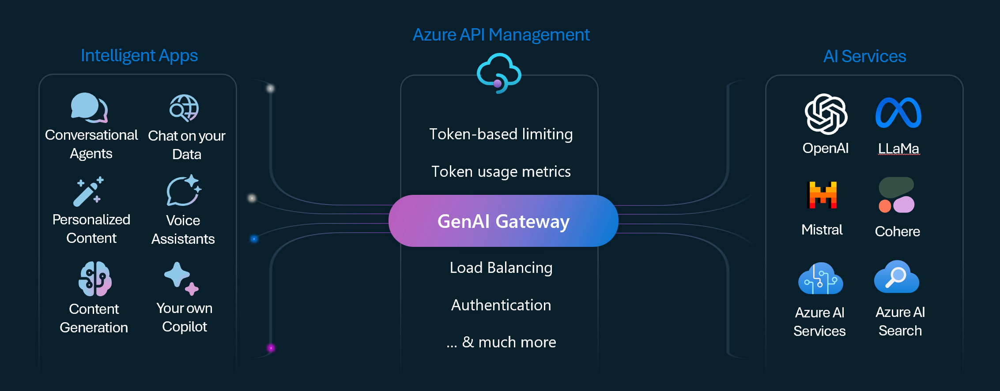

# Azure API Management with OpenAI

## Introduuction

`Azure API Management` is a fully managed service that enables customers to publish, secure, transform, maintain, and monitor APIs. With `Azure API Management`, customers can create consistent and modern API gateways for existing back-end services hosted anywhere, secure and protect APIs from abuse and overuse, and gain insights into API usage and health.

With the rise of AI services, customers can now integrate AI services into their APIs to provide intelligent capabilities to their applications. 

In this lab, we will demonstrate how to integrate `Azure API Management` with `Azure AI Services` to provide AI capabilities to APIs. 



We will use `OpenAI` as an example of AI services.

```sh
$RG = "rg-apim-genai-openai-0017"
$location = "swedencentral"
$aiServiceName = "ai-genai-openai-0017"
$apimName = "apim-genai-openai-0017"

# create Azure resource group
az group create --name $RG --location $location

# create API Management with Comsumption mode
az apim create --name $apimName --resource-group $RG --location $location --sku-name Consumption --publisher-email "noreply@microsoft.com" --publisher-name "Microsoft" --enable-managed-identity

# create Azure AI services
az cognitiveservices account create -n $aiServiceName -g $RG --kind AIServices --sku S0 --location $location --custom-domain $aiServiceName

# create deployment for ChatGPT 4o model
az cognitiveservices account deployment create -n $aiServiceName -g $RG `
    --deployment-name gpt-4o `
    --model-name gpt-4o `
    --model-version "2024-08-06" `
    --model-format OpenAI `
    --sku-capacity "150" `
    --sku-name "GlobalStandard"

# create role assignment for API Management to access Azure AI Services
$apimIdentityPrincipalId = $(az apim show --name $apimName --resource-group $RG --query identity.principalId -o tsv)
$aiServicesResourceId = $(az cognitiveservices account show --name $aiServiceName --resource-group $RG --query id -o tsv)
az role assignment create --role "Cognitive Services OpenAI User" --assignee $apimIdentityPrincipalId --scope $aiServicesResourceId

# import OpenAPI specification for OpenAI to API Management
$aiServiceUrl = $(az cognitiveservices account show -n $aiServiceName -g $RG --query properties.endpoint -o tsv)
az apim api import --service-name $apimName -g $RG `
                   --display-name "OpenAI" `
                   --path openai `
                   --specification-url "https://raw.githubusercontent.com/Azure/azure-rest-api-specs/refs/heads/main/specification/cognitiveservices/data-plane/AzureOpenAI/inference/stable/2024-10-21/inference.json" `
                   --specification-format OpenApiJson `
                   --api-type http `
                   --protocols "https" `
                   --service-url ${aiServiceUrl}openai `
                   --subscription-required true `
                   --subscription-key-header-name "api-key" `
                   --subscription-key-query-param-name "api-key"

# create subscription for API Management
# Not supported in Azure CLI, use Azure Portal or ARM template

# Add authentication to the policy
# Not supported in Azure CLI, use Azure Portal or ARM template
# Use the policy in file policy.xml

# test the API: chatting with Chat GPT 4o model

```

## Important notes

Starting in July 2019, Azure AI services use custom subdomain names for each resource created through the Azure portal, Azure Cloud Shell, or Azure CLI. Unlike regional endpoints, which were common for all customers in a specific Azure region, custom subdomain names are unique to the resource. Custom subdomain names are required to enable features like Microsoft Entra ID for authentication.
Src: https://learn.microsoft.com/en-us/azure/ai-services/cognitive-services-custom-subdomains
