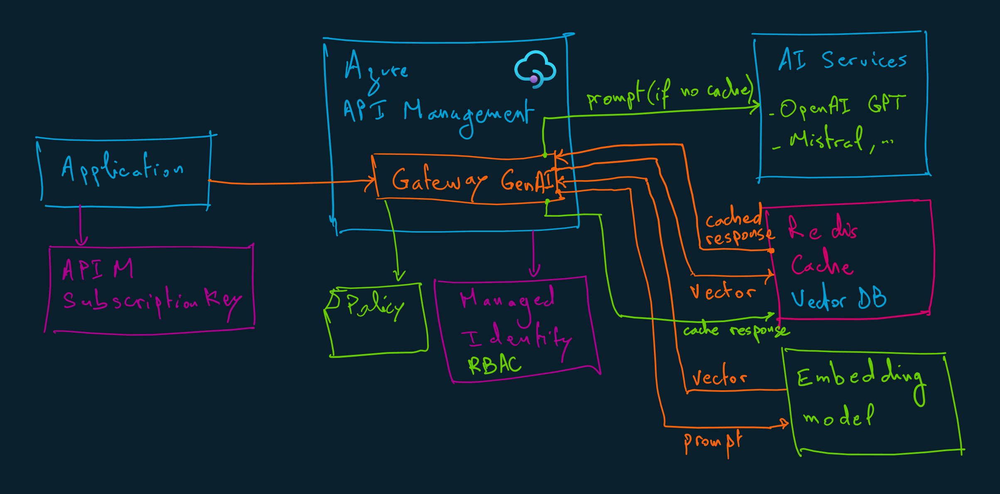

# Azure API Management with OpenAI



```sh
terraform init
terraform apply -auto-approve
```

## Important notes

Starting in July 2019, Azure AI services use custom subdomain names for each resource created through the Azure portal, Azure Cloud Shell, or Azure CLI. Unlike regional endpoints, which were common for all customers in a specific Azure region, custom subdomain names are unique to the resource. Custom subdomain names are required to enable features like Microsoft Entra ID for authentication.
Src: https://learn.microsoft.com/en-us/azure/ai-services/cognitive-services-custom-subdomains
