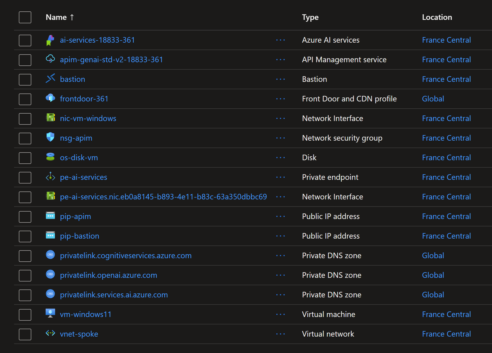
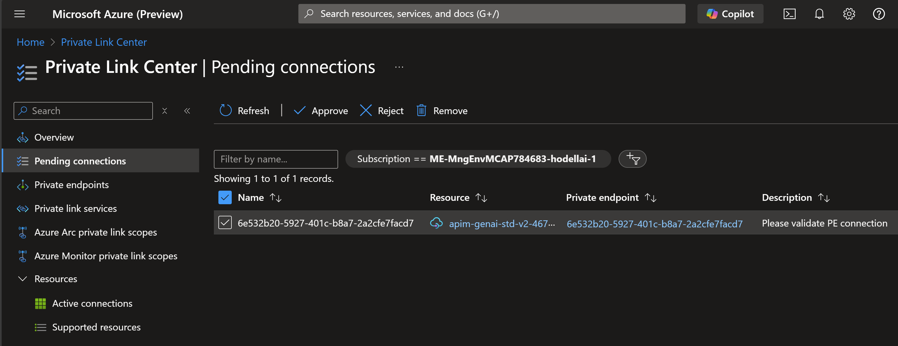

# Azure API Management with OpenAI and Frontdoor

This repo shows how to deploy an Azure API Management service with OpenAI and Frontdoor using Terraform.
All resources are deployed in private mode using Private Endpoint, except the Frontdoor that exposes publicly the services.

## Deploy the resources

This repository contains a Terraform script to deploy an Azure API Management service with OpenAI and Frontdoor.

```sh
terraform init
terraform plan -out tfplan
terraform apply tfplan
```

 The deployment includes the following resources:



## Approving the Private Link connection

After the deployment is complete, you need to approve the Private Link connection for the API Management service. You can do this using the Azure portal or Azure CLI. Navigate to Private Link Center > Pending connections and click approve.



## How to test access to GPT model ?

Open and run the python notebook `test-connection-to-llm-models.ipynb` to test access to the GPT model.

## Important notes

Error message: Setting up Private Endpoint Connection for API Management service /subscriptions/dcef7009-6b94-4382-afdc-17eb160d709a/resourceGroups/rg-apim-genai-openai-baqam-361/providers/Microsoft.ApiManagement/service/apim-genai-prm-v2-baqam-361 which is of PremiumV2 is not supported yet.

Setting up 'Internal' Internal Virtual Network Type is not supported for Sku Type 'StandardV2'.

API Management service V2 outbound Virtual Network integration with SubnetId `/subscriptions/dcef7009-6b94-4382-afdc-17eb160d709a/resourceGroups/rg-apim-genai-openai-baqam-361/providers/Microsoft.Network/virtualNetworks/vnet-spoke/subnets/snet-apim` requires subnet to be delegated to Microsoft.Web/serverFarms. Please refer to https://aka.ms/apim-vnet-outbound for more details.

Error: expected private_link.0.target_type to be one of ["blob" "blob_secondary" "sites" "web"], got Gateway.

Blocking all public network access by setting property `publicNetworkAccess` of API Management service is not enabled during service creation.

Starting in July 2019, Azure AI services use custom subdomain names for each resource created through the Azure portal, Azure Cloud Shell, or Azure CLI. Unlike regional endpoints, which were common for all customers in a specific Azure region, custom subdomain names are unique to the resource. Custom subdomain names are required to enable features like Microsoft Entra ID for authentication.
Src: https://learn.microsoft.com/en-us/azure/ai-services/cognitive-services-custom-subdomains


