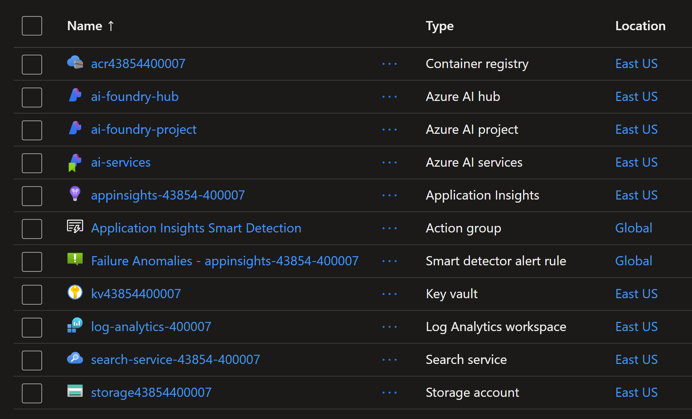

# Azure AI Foundry Terraform implementation

## Overview

This document provides an overview of the Azure AI Foundry Terraform implementation.

The following resources are created:



## How to deploy ?

```sh
terraform init
terraform plan -out tfplan
terraform apply tfplan
```

## How to test access to GPT model ?

Open and run the python notebook `test-connection-to-llm-models.ipynb` to test access to the GPT model.

## Findings

If you require isolation between dev, test, and production as part of your LLMOps or MLOps strategy, consider creating a hub for each environment.
Src: https://learn.microsoft.com/en-us/azure/ai-studio/concepts/architecture#organize-for-your-teams-needs